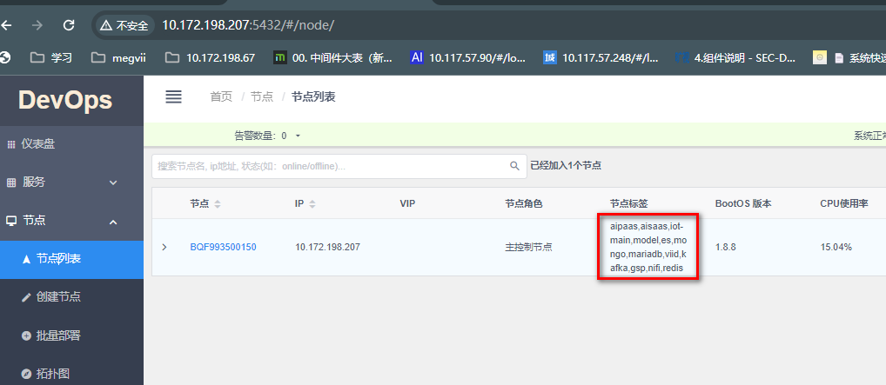
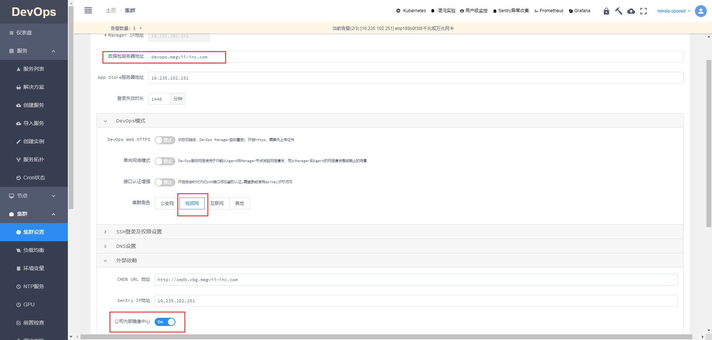

# 232环境部署
  ## 部署清单
  - devops安装包,
    - devops的安装包是可以在公司提供的链接进行下载,但是我权限不够,如果以后要是有一些其他环境的部署,可以请其他人帮忙下载,这个包不是很大,所以还好
    - 下载地址: devops.megvii-inc.com/download/archived/23.5.2/latest/,这里需要注意确定cpu型号,是ARM还是AMD
  - chef安装包,
    - chef安装包跟devops一样
    - 下载地址: https://sdc.devops.megvii-inc.com/#/resource/?p=chef%2Fbootstrap%2F
  - tianshu安装包
    - 下载地址: https://cookbook.bistro.sh/catalog/staging/bpg.smartcity.tianshu/2.0.5
    - 需要下载全量包,这个版本node的全量包39.8g,所以需要在服务器上进行下载,windows下载太慢了,下载命令可以在页面进行查看
  - ipu.core.gpu-exporter安装包
    - 下载地址: https://cookbook.bistro.sh/catalog/staging/ipu.core.gpu-exporter/1.0.2
    - 建议直接用哪个命令在服务器下载: sudo chef cookbook pack ipu/core/gpu-exporter -v 1.0.2 --local-path=gpu-exporter.tar
    - 不是很大,页面直接下载即可

  ## 安装devops
  - sudo bash devops-manager_23.5.2_linux-amd64.deb.run
  - [具体安装流程见](/videos/devops部署视频.mp4)

  ## 配置devops
  - 
  - 

  ## 修改values.yaml
  - chef目录库地址: https://cookbook.bistro.sh/catalog/staging
  - values.yaml需要根据我们要部署的服务去chef的目录库中找到对应的版本服务的values,这里的values不修改直接部署会有问题
  - 目前需要修改3处
    - [gb.gbid]和[platformCode]需要修改为当前部署节点的对应平台id
    - [node.type]需要修改为当前部署的节点类型下级就是node

  ## 部署命令
  - 测试部署:`sudo chef install bpg/smartcity/tianshu -v ${version} -p ${projectName} --kubernetes {devopsManagerIp} -f values.yaml --wait=true --dry-run`
  - 部署(--wait=true不能少): `sudo chef install bpg/smartcity/tianshu -v ${version} -p ${projectName} --kubernetes {devopsManagerIp} -f values.yaml --wait=true`

  ## 如果部署过程中失败,需要卸载重新部署,下面三步都需要按顺序依次执行
  - 全量卸载: `sudo devops-destroy-world.sh`
  - 不删除/mnt/data 卸载: `sudo devops-destroy-world.sh --except-mnt`
  - 通过chef卸载: `sudo chef uninstall bpg/smartcity/tianshu -p ${projectName} --kubernetes {devopsManagerIp}`
  - 卸载后需检查是否卸载干净:
    - 进入服务器的 /mnt/data,是否还有目录,如果有,则删掉
    - 进入服务器的 /mnt/data-important,是否还有目录,如果有,则删掉
    - data目录本身是无法被删掉的,这是正常的,最后的理想状态就是/mnt下只有一个空的data目录
  - 卸载完成之后就可以从第一步安devops开始重新弄了,有的时候安不上可能是文件的问题;